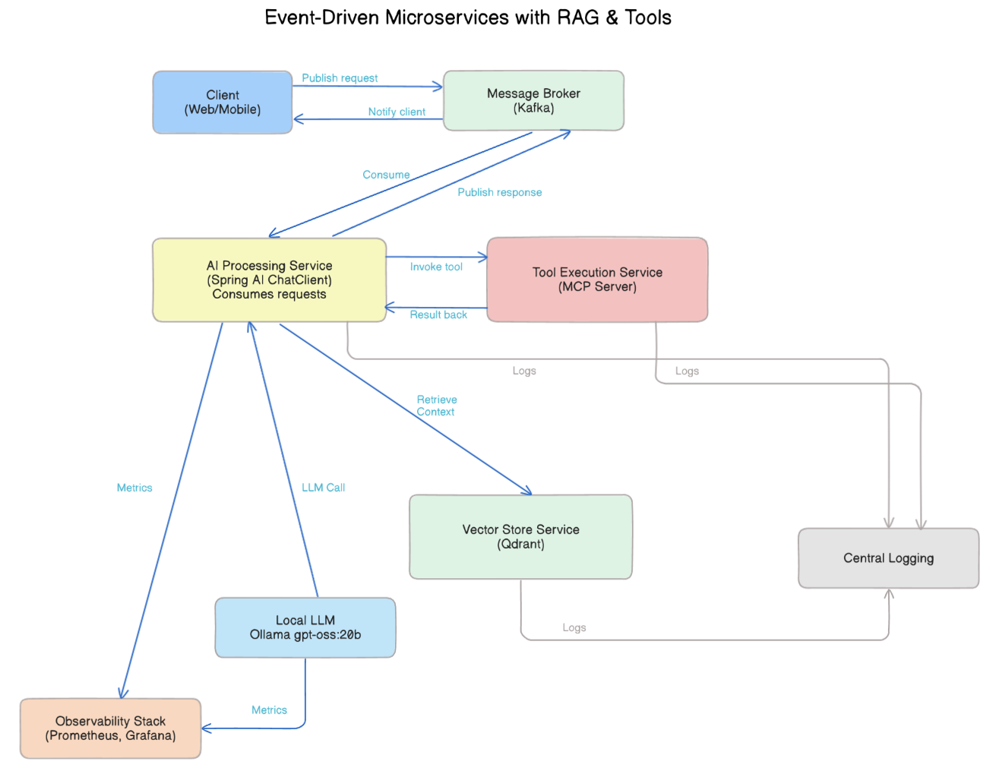
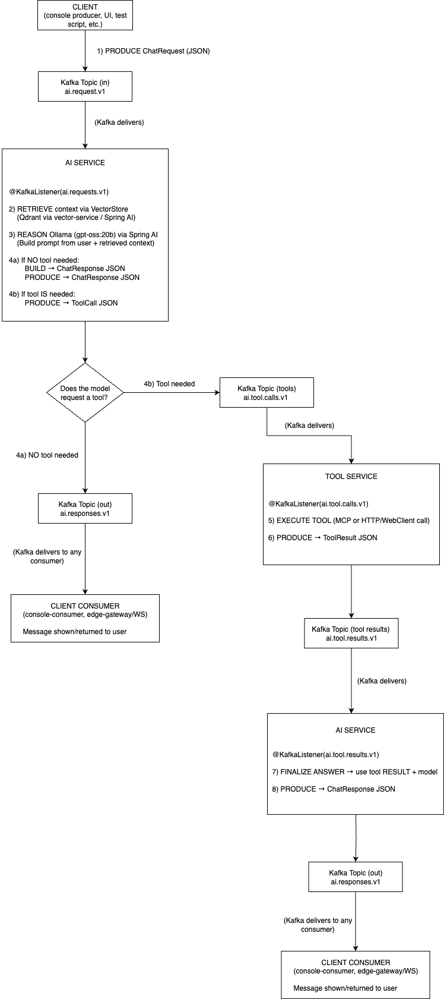

# Spring AI Event-Driven RAG with Tools
Date: Aug 13 · Version: v0.1.0

Event-driven microservices architecture built with Spring AI, Apache Kafka, and Ollama for Retrieval-Augmented Generation (RAG) plus tool execution via Model Context Protocol (MCP). Includes vector search (Qdrant), local LLM reasoning, and observability with Prometheus + Grafana.

## Architecture



## Processing Flow



# Running locally


## Pre-requisites

* Ollama with nomic-embed-text.
* At least one model loaded in Ollama (gpt-oss:20b, gemma3:4b, etc).
* Make sure the application.yml correctly points to the model you've installed.

## Getting things ready

`mvn clean install`

`docker compose -f docker/compose.yml up -d`

### Start each module:

`mvn -q -pl vector-service spring-boot:run`

`mvn -q -pl ai-service spring-boot:run`

`mvn -q -pl common install`

`mvn -q -pl tool-service spring-boot:run`

`mvn -q -DskipTests -pl mcp-server -am package`

`docker compose -f docker/compose.yml up -d --build mcp-server`

`mvn -q -pl edge-gateway spring-boot:run`


## TEST MCP SERVER

### MCP health

`curl -s http://localhost:8091/actuator/health`

### MCP direct poke

```bash
curl -s -X POST http://localhost:8091/mcp/tools/launchCampaign \
-H 'Content-Type: application/json' -d '{"budget":500}'
{"campaignId":"cmp_C899DC23","status":"SCHEDULED","budget":500}
```

```bash
curl -s -X POST http://localhost:8091/mcp/tools/launchCampaign \
-H 'Content-Type: application/json' \
-d '{"requestId":"demo-1","tool":"launchCampaign","args":{"budget":500}}'
{"campaignId":"cmp_E86539B5","status":"SCHEDULED","budget":500}
```

### Create topics

`docker exec -it $(docker ps --filter name=kafka -q) bash`

#### Inside the container:
`export KAFKA_BIN=/opt/bitnami/kafka/bin`

```bash
$KAFKA_BIN/kafka-topics.sh --bootstrap-server localhost:9092 \
--create --if-not-exists --topic ai.tool.calls.v1 --partitions 1 --replication-factor 1
```

```bash
$KAFKA_BIN/kafka-topics.sh --bootstrap-server localhost:9092 \
--create --if-not-exists --topic ai.tool.results.v1 --partitions 1 --replication-factor 1
```

```bash
/opt/bitnami/kafka/bin/kafka-console-consumer.sh \
  --bootstrap-server localhost:9092 \
  --topic ai.tool.results.v1 \
  --from-beginning
```

#### In another terminal, produce tool calls:

`docker exec -it $(docker ps --filter name=kafka -q) bash`

```bash
/opt/bitnami/kafka/bin/kafka-console-producer.sh \
--bootstrap-server kafka:9092 \
--topic ai.tool.calls.v1
```

#### launchCampaign (marketing, stateless)

```json
{"requestId":"demo-1","tool":"launchCampaign","args":{"channel":"LinkedIn","audienceId":789,"budget":500,"creative":"spring-sale-01"}}
```

#### lookupOrder (ops, read-only)

```json
{"requestId":"demo-2","tool":"lookupOrder","args":{"orderId":"A1234"}}
```

#### checkSanctionsList (finance, rule-based)

```json
{"requestId":"demo-3","tool":"checkSanctionsList","args":{"name":"John Danger"}}
```


## TEST VECTOR-SERVICE

### Upsert sample documents

#### Request

`POST http://localhost:8081/vectors/upsert`

```json
[
{
"id": "doc:1",
"text": "Qdrant is a vector database for semantic search and retrieval. It stores vectors and metadata and supports filtering and payloads."
},
{
"id": "doc:2",
"text": "Spring AI provides model clients and vector stores. It integrates Ollama locally for chat and embeddings."
},
{
"id": "doc:3",
"text": "Kafka is a distributed log used for event-driven architectures, decoupling producers and consumers for scalable systems."
}
]
```

### Search in the vector store

#### Request

`GET http://localhost:8081/vectors/search?q=How%20does%20Qdrant%20help%20RAG%3F&k=3`

```json
[
{
"id": "570becd5-cbb3-43d7-baa6-9e6925265819",
"text": "Qdrant is a vector database for semantic search and retrieval. It stores vectors and metadata and supports filtering and payloads.",
"media": null,
"metadata": {
"distance": 0.3066008,
"text": "Qdrant is a vector database for semantic search and retrieval. It stores vectors and metadata and supports filtering and payloads.",
"id": "doc:1"
},
"score": 0.69339919090271
},
{
"id": "d503aed8-799b-4f3e-8629-c1b5788d8861",
"text": "Spring AI provides model clients and vector stores. It integrates Ollama locally for chat and embeddings.",
"media": null,
"metadata": {
"distance": 0.6021944,
"text": "Spring AI provides model clients and vector stores. It integrates Ollama locally for chat and embeddings.",
"id": "doc:2"
},
"score": 0.3978055715560913
},
{
"id": "72a6917b-9ed3-4b45-aab9-3fde072e4af0",
"text": "Kafka is a distributed log used for event-driven architectures, decoupling producers and consumers for scalable systems.",
"media": null,
"metadata": {
"distance": 0.60606,
"id": "doc:3",
"text": "Kafka is a distributed log used for event-driven architectures, decoupling producers and consumers for scalable systems."
},
"score": 0.3939399719238281
}
]
```

## Test AI-SERVICE

### Connect to the Kafka container

`docker exec -it $(docker ps --filter name=kafka -q) bash`

### Create the topics

```bash
/opt/bitnami/kafka/bin/kafka-topics.sh \
 --bootstrap-server kafka:9092 \
 --create --topic ai.responses.v1 \
 --partitions 1 \
 --replication-factor 1
```

```bash
/opt/bitnami/kafka/bin/kafka-topics.sh \
 --bootstrap-server kafka:9092 \
 --create --topic ai.requests.v1 \
 --partitions 1 \
 --replication-factor 1
```

### Verify the topics

`/opt/bitnami/kafka/bin/kafka-topics.sh --bootstrap-server kafka:9092 --list`

It should show something like:

```
__consumer_offsets 
ai.requests.v1
ai.responses.v1
ai.tool.results.v1
```

### Start Kafka console consumer

```bash
/opt/bitnami/kafka/bin/kafka-console-consumer.sh \
--bootstrap-server kafka:9092 \
--topic ai.responses.v1 \
--from-beginning
```

### In another terminal, send a request

`docker exec -it $(docker ps --filter name=kafka -q) bash`

```bash
/opt/bitnami/kafka/bin/kafka-console-producer.sh \
--bootstrap-server kafka:9092 \
--topic ai.requests.v1
```

```
{"requestId":"r-001","userId":"u-1","sessionId":"s-1","query":"Give me a short explanation of Qdrant and why it helps RAG.","metadata":{},"ts":"2025-08-11T00:00:00Z"}
```
