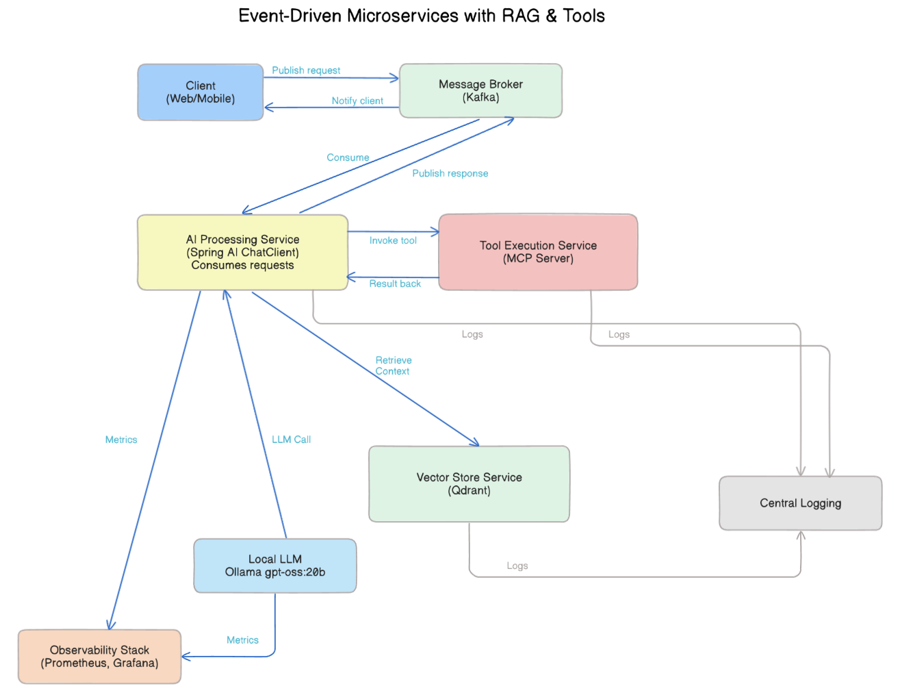
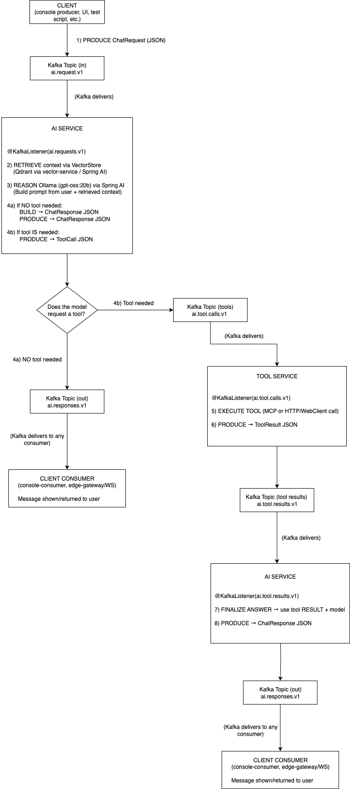

# Spring AI Event-Driven RAG with Tools
Date : Oct 06 · Version: v0.2.0
Date: Aug 13 · Version: v0.1.0

Event-driven microservices architecture built with Spring AI, Apache Kafka, and Ollama for Retrieval-Augmented Generation (RAG) plus tool execution via Model Context Protocol (MCP). Includes vector search (Qdrant), local LLM reasoning, and observability with Prometheus + Grafana.

## Architecture



## Processing Flow



## Pre-requisites

* Ollama with nomic-embed-text. You can use Ollama Cloud too ([Ollama's documentation](https://docs.ollama.com))
* At least one model loaded in Ollama (gpt-oss:20b, ddeepseek-v3.1:671b-cloud, gemma3:latest, etc). ([List of all available models](https://ollama.com/search))
* Make sure the application.yml correctly points to the model you've installed.

# Testing the Event-Driven RAG System

## Prerequisites

### Before testing, ensure all services are running:

1. Start Docker services: 

    ```bash
    docker compose -f docker/compose.yml up -d
    ```

2. Create the topics

    `docker exec -it $(docker ps --filter name=kafka -q) bash`

    `export KAFKA_BIN=/opt/kafka/bin`

    ```bash
    $KAFKA_BIN/kafka-topics.sh --bootstrap-server localhost:9092 \
    --create --if-not-exists --topic ai.tool.calls.v1 --partitions 1 --replication-factor 1
    ```

    ```bash
    $KAFKA_BIN/kafka-topics.sh --bootstrap-server localhost:9092 \
    --create --if-not-exists --topic ai.tool.results.v1 --partitions 1 --replication-factor 1
    ```
    ```bash
    $KAFKA_BIN/kafka-topics.sh --bootstrap-server kafka:9092 \
    --create --if-not-exists --topic ai.responses.v1 --partitions 1 --replication-factor 1
    ```

    ```bash
    $KAFKA_BIN/kafka-topics.sh --bootstrap-server kafka:9092 \
    --create --if-not-exists --topic ai.requests.v1 --partitions 1 --replication-factor 1
    ```

3. Start each module in separate terminals:

    #### Terminal 1
    `mvn clean install`

    #### Terminal 2
    `mvn -q -pl vector-service spring-boot:run`

    #### Terminal 3
    `mvn -q -pl ai-service spring-boot:run`

    #### Terminal 4
    `mvn -q -pl tool-service spring-boot:run`

    #### Terminal 5
    `mvn -q -pl edge-gateway spring-boot:run`

    ### Terminal 6
    `mvn -q -DskipTests -pl mcp-server -am package`
    `docker compose -f docker/compose.yml up -d --build mcp-server`

4. Check if Qdrant is accessible:

    ```bash    
    curl -s http://localhost:6333
    ```

5. Check if Kafka is running:
    
    ```bash
    docker ps | grep kafka
    ```

6. Add documents to vector store:

    ```bash
    curl -X POST http://localhost:8081/vectors/upsert \
      -H "Content-Type: application/json" \
      -d '[
        {
          "id": "doc:1",
          "text": "Qdrant is a vector database for semantic search and retrieval. It stores vectors and metadata and supports filtering and payloads."
        }
      ]'
    ```

7. Search in vector store:

    ```bash
    curl "http://localhost:8081/vectors/search?q=What%20is%20Qdrant%3F&k=1"
    ```

## Testing Scenario 1: No Tool Needed

This scenario tests when the AI can answer a question directly without requiring any external tools.

### Using HTTP Ingestion + WebSocket Streaming

You can trigger the event-driven flow by calling the REST ingest endpoint exposed by `edge-gateway` and subscribing over WebSocket/STOMP for streaming responses.

1. Run python3 -m http.server 8000 inside of public folder

2. Press Connect (SocketJS) button.

3. Press Send Query button.

4. Observe streaming messages arriving on Stream Log.

**Expected Result**: Note that toolCalls is empty, indicating no tools were needed.

## Testing Scenario 2: Tool Needed

This scenario tests when the AI determines that a specific tool (checkSanctionsList) needs to be executed to fulfill the request.

### Using HTTP Ingestion + WebSocket Streaming

You can trigger the event-driven flow by calling the REST ingest endpoint exposed by `edge-gateway` and subscribing over WebSocket/STOMP for streaming responses.

1. Run python3 -m http.server 8000 inside of public folder

2. Press Connect (SocketJS) button.

3. Change the query to: "I need to check if customer John Danger is on our sanctions list"

4. Press Send Query button.

5. Observe streaming messages arriving on Stream Log.

**Expected Result**: The system should return a single response that will show the checkSanctionsList tool was executed with the name "John Danger" and will return a single response indicating that John Danger is on the sanctions list with high confidence.

## Summary

These examples demonstrate:

1. No Tool Needed: When the AI can answer directly using its knowledge and retrieved context, it sends a response with an empty toolCalls array.

2. Tool Needed: When the AI determines a tool is required:

    * It sends a tool call message to the ai.tool.calls.v1 topic
    * The Tool Service executes the tool via the MCP Server
    * The result is sent to ai.tool.results.v1
    * The AI Service processes the result and sends the final response

The system effectively distinguishes between queries that can be answered directly and those that require external tool execution, demonstrating the event-driven RAG architecture with tool calling capabilities.